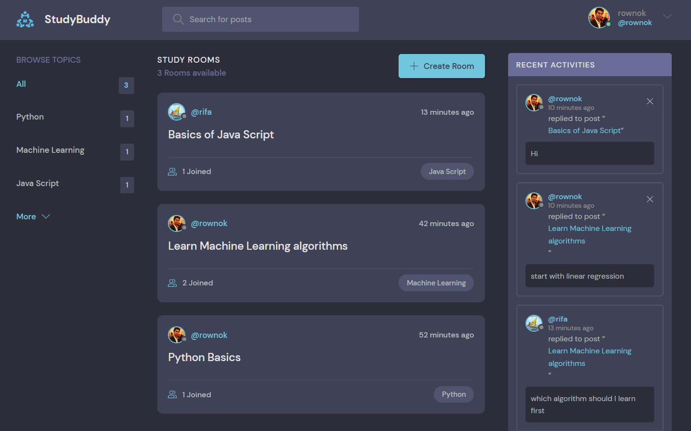
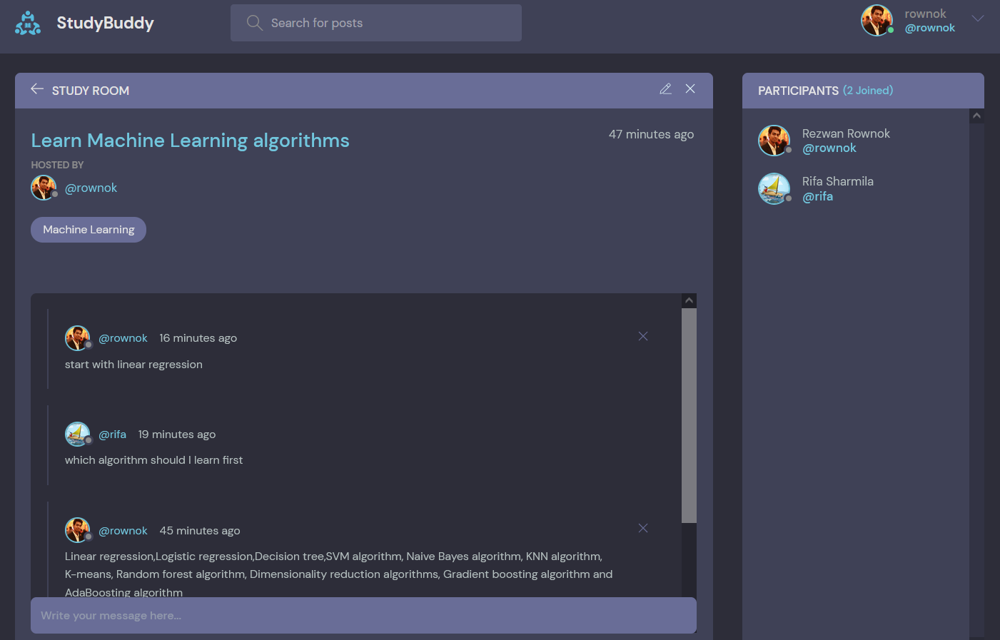
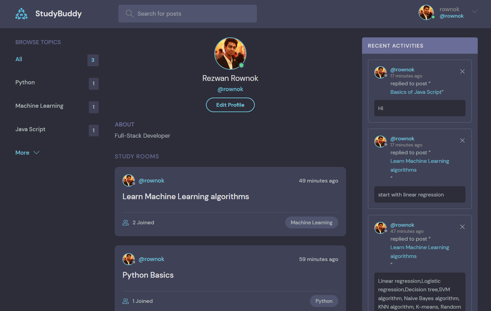

# StudyBud Find study Partners around the world

You can visit and experience it -> https://studybud27.herokuapp.com/

# Installation

- 1 - create a virtual environment and activate
- 2 - pip install virtualenv
- - virtualenv envname
- - envname\scripts\activate
- 3 - cd into project
- 4 - pip install -r requirements.txt
- 5 - python manage.py runserver

# Features

- Create Rooms
- Browse topics
- Find Recent activities
- Search for posts
- User Registration & Authenticaiton
- Building an API with Django REST Framework (DRF)

# Tech Stack

- Django
- Django REST Framework

# Home Page

# Room Page

# Profile Page

